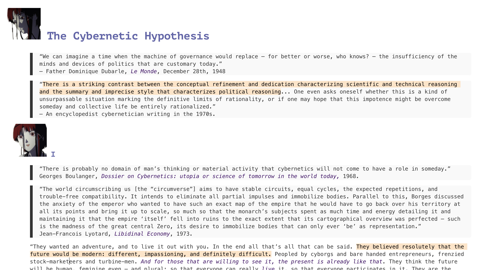
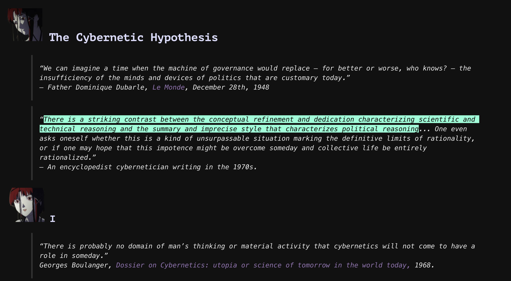

# cyberia_typora_theme
***Cyberia*** is a high contrast typora theme modified from the official typora theme [monospace](https://github.com/typora/typora-monospace-theme).
It contains a light theme Cyberia and a dark theme Cyberia Dark.

It's inspired by *"Serial Experiments Lain"*.

The png resources come from a fan-site [Wired Sound For Wired People](https://fauux.neocities.org/downloads.html) bulit by [ｆａｕｕｘ](https://fauux.neocities.org/AboutMe.html).

## Install
Download, and move files under `theme` folder into [Typora's Theme Folder](http:/theme.typora.io/doc/Install-Theme/).
Or download the latest release, and extract contents into "Typora's Theme Folder".

